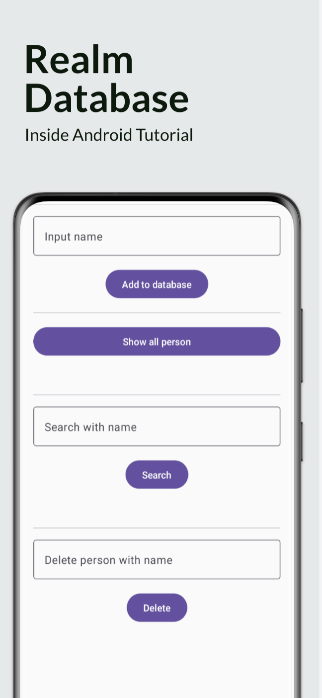

# Inside Android Repository

Welcome to the Inside Android GitHub repository! This repository is dedicated to the Inside Android YouTube channel, where you can find a wealth of content related to Android app development, UI/UX design, Kotlin programming, industry trends, tools, frameworks, and much more. Whether you're an aspiring developer, a seasoned programmer, or simply curious about the dynamic world of Android, there's something here for you.

## About Inside Android

Inside Android is a YouTube channel that aims to provide you with insightful and engaging content about the world of Android development. From in-depth tutorials to thought-provoking discussions and expert interviews, we cover a wide range of topics to cater to your learning and exploration needs. Our goal is to create a community where knowledge is shared, discussions are encouraged, and growth is fostered.

### Connect with Us

- **Website:** [insideandroid.in](https://insideandroid.in)
- **Email:** info@insideandroid.in
- **Instagram:** [inside.android](https://instagram.com/inside.android)
- **Facebook:** [inside.android99](https://www.facebook.com/inside.android99)
- **Host Instagram:** [ayaz_i_am_](https://instagram.com/ayaz_i_am_)

### Content Highlights

- Engaging tutorials that cover app building, UI/UX design, and Kotlin programming.
- Thought-provoking discussions that delve into the latest trends, tools, and frameworks in the Android ecosystem.
- Expert interviews offering valuable insights from industry professionals.

### Join Our Community

We invite you to engage with our content by liking, sharing, and subscribing to our YouTube channel. By subscribing, you'll stay up-to-date with our latest videos, ensuring you don't miss out on any of the exciting discussions and tutorials we have in store for you. Our community is growth-focused and open to all levels of expertise, so whether you're just starting or have years of experience, you'll find something valuable here.

Embark on this transformative experience with us as we navigate the ever-evolving landscape of Android development. Thank you for being a part of Inside Android!

## Getting Started

To get started, simply explore the contents of this repository. You'll find resources, code samples, and more that complement the videos on our YouTube channel. If you have any questions, suggestions, or feedback, feel free to reach out to us via the contact information provided above.

Happy coding and learning!

---
